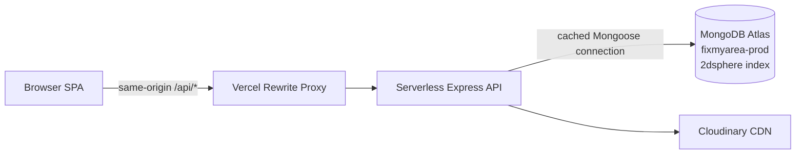

# 🛠️ FixMyArea — Report. Track. Resolve.

A full-stack civic issue reporting platform where citizens can report local problems such as **potholes, garbage, broken streetlights, and other civic issues** with geotagged photos, track their resolution publicly, and interact with reports through comments and upvotes.

Officials can manage reported issues through a **role-gated admin dashboard** with status tracking and analytics.

### 🌐 Live Application

**Frontend:** https://fixmyarea-ten.vercel.app
**API Health:** https://fixmyarea-api.vercel.app/api/health

---

## 📌 The Problem

Civic complaints often disappear into WhatsApp groups, phone calls, or informal conversations.

There is usually:

* ❌ No permanent public record
* ❌ No transparent status
* ❌ No centralized tracking
* ❌ Limited accountability
* ❌ No structured way to analyze recurring problems

### 💡 The Solution

**FixMyArea** turns civic complaints into structured, publicly trackable issues.

Citizens can:

1. Create an account
2. Report a civic problem
3. Pin its exact location on a map
4. Upload photographic evidence
5. Track its status
6. Upvote issues
7. Comment on reports

Administrators can manage issues and update their resolution status through a dedicated dashboard.

---

# ✨ Features

## 🔐 Authentication & Authorization

* JWT-based authentication
* JWT stored in **httpOnly cookies**
* Password hashing using **bcrypt**
* Two application roles
* UI-level role gating
* API-level authorization enforcement
* `requireAuth` middleware
* `requireRole` middleware
* Correct HTTP semantics:

  * `401 Unauthorized` → user is not authenticated
  * `403 Forbidden` → authenticated user lacks the required role

---

## 📍 Geolocation & Maps

* Interactive map picker using **Leaflet**
* OpenStreetMap tiles
* Click-to-pin location selection
* Locations stored as **GeoJSON**
* MongoDB `2dsphere` index
* Architecture prepared for geospatial queries such as:

```text
Find all civic issues within 2 km of a location
```

Future `$near` queries can therefore be added without changing the underlying location model.

---

## 📷 Photo Upload Pipeline

Issue reports can include photographic evidence.

### Upload flow

```text
Browser
   ↓
Client-side preview
   ↓
Multipart FormData
   ↓
Multer memory storage
   ↓
Server-side type/size validation
   ↓
Cloudinary
   ↓
CDN-hosted image URL
   ↓
MongoDB issue document
```

### Upload protections

* File type validation
* Server-side size validation
* 4 MB application photo limit
* Cloudinary CDN storage
* Client-side image preview

The 4 MB limit intentionally stays below Vercel's serverless request-body constraints.

---

## 🗳️ Public Issue Feed

The issue feed is publicly accessible.

Features include:

* Category filtering
* Status filtering
* Pagination
* Issue details
* Public status timeline
* Comments
* Upvotes

Example filtering:

```http
GET /api/issues?status=in_progress&category=pothole&page=1
```

---

## 👍 Upvotes

Users can upvote or remove their upvote from an issue.

The implementation uses MongoDB atomic operators:

```javascript
$addToSet
$pull
```

This avoids a traditional:

```text
READ → MODIFY → WRITE
```

pattern and reduces the possibility of concurrent update races.

---

## 💬 Comments

Authenticated users can comment on reported issues.

Comments are associated with their respective issue and can be displayed as part of the public issue discussion.

---

# 📈 Status Timeline

Every issue progresses through a structured lifecycle:

```text
reported
    ↓
acknowledged
    ↓
in_progress
    ↓
resolved
```

Instead of storing only the current status, FixMyArea maintains a dedicated **`StatusEvent` collection**.

This creates an immutable audit trail of status changes.

Example:

```text
Issue reported
      ↓
Admin acknowledged
      ↓
Work started
      ↓
Issue resolved
```

This makes the resolution process publicly traceable.

---

# 🛡️ Admin Dashboard

Administrators have access to a dedicated dashboard.

Dashboard capabilities include:

* Issue statistics
* Status distribution
* Category distribution
* Aggregated issue data
* Issue management
* Status updates
* Recharts-based visualizations

Statistics are generated using **MongoDB aggregation pipelines** rather than calculating everything on the client.

---

# 🏗️ Architecture



### Request architecture

```text
React SPA
   │
   │ /api/*
   ▼
Vercel Rewrite Proxy
   │
   ▼
Serverless Express API
   │
   ├── Authentication / Authorization
   │
   ├── Issue Management
   │
   ├── Comments
   │
   ├── Upvotes
   │
   ├── Status Timeline
   │
   └── Admin Analytics
          │
          ├──────────────► MongoDB Atlas
          │
          └──────────────► Cloudinary
```

---

# 🚀 Deployment Architecture

FixMyArea is deployed using a serverless architecture on Vercel.

## Same-Origin API Proxy

The browser communicates with the frontend domain using:

```text
/api/*
```

Vercel rewrites these requests to the deployed Express API.

This provides a single browser-facing origin:

```text
Browser
   ↓
fixmyarea-ten.vercel.app/api/*
   ↓
Vercel Rewrite
   ↓
fixmyarea-api.vercel.app
```

### Why?

The main reason is authentication.

Keeping browser requests same-origin helps keep the JWT authentication cookie **first-party**, avoiding common third-party-cookie restrictions.

---

## Serverless Express

The Express application is exported for Vercel instead of calling:

```javascript
app.listen(...)
```

The serverless function handles incoming requests independently.

---

## Cached MongoDB Connections

Serverless environments can create multiple function instances.

Creating a new MongoDB connection for every request could quickly exhaust MongoDB Atlas connection limits.

Therefore, the application caches the Mongoose connection across warm invocations.

Conceptually:

```text
Request
   ↓
Check cached connection
   │
   ├── Available → reuse connection
   │
   └── Missing → create connection
```

---

# 🧰 Tech Stack

| Layer            | Technology         |
| ---------------- | ------------------ |
| Frontend         | React 19           |
| Build Tool       | Vite               |
| Styling          | Tailwind CSS       |
| Routing          | React Router       |
| Charts           | Recharts           |
| Maps             | Leaflet            |
| Map Data         | OpenStreetMap      |
| Backend          | Node.js            |
| API              | Express            |
| Deployment       | Vercel Serverless  |
| Database         | MongoDB Atlas      |
| ODM              | Mongoose           |
| Geospatial Data  | GeoJSON            |
| Geospatial Index | MongoDB `2dsphere` |
| Authentication   | JWT                |
| Password Hashing | bcrypt             |
| Cookies          | httpOnly cookies   |
| File Upload      | Multer             |
| Image Storage    | Cloudinary         |

---

# 🔌 API

## Authentication

| Method | Endpoint             | Access        | Purpose                          |
| ------ | -------------------- | ------------- | -------------------------------- |
| POST   | `/api/auth/register` | Public        | Create account and set cookie    |
| POST   | `/api/auth/login`    | Public        | Authenticate user and set cookie |
| GET    | `/api/auth/me`       | Authenticated | Get current user                 |
| POST   | `/api/auth/logout`   | Public        | Clear authentication cookie      |

---

## Issues

| Method | Endpoint                   | Access        | Purpose                                  |
| ------ | -------------------------- | ------------- | ---------------------------------------- |
| GET    | `/api/issues`              | Public        | Get issue feed                           |
| GET    | `/api/issues/:id`          | Public        | Get issue details, timeline and comments |
| POST   | `/api/issues`              | Authenticated | Create civic issue                       |
| POST   | `/api/issues/:id/upvote`   | Authenticated | Toggle upvote                            |
| POST   | `/api/issues/:id/comments` | Authenticated | Add comment                              |
| PATCH  | `/api/issues/:id/status`   | Admin         | Update issue status                      |

### Issue feed query parameters

```text
status
category
page
```

Example:

```http
GET /api/issues?status=resolved&category=garbage&page=2
```

---

## Admin

| Method | Endpoint           | Access | Purpose                             |
| ------ | ------------------ | ------ | ----------------------------------- |
| GET    | `/api/admin/stats` | Admin  | Get aggregated dashboard statistics |

---

# 🔒 Authorization Model

The application uses both **authentication** and **role-based authorization**.

```text
Request
   │
   ▼
Is JWT present and valid?
   │
   ├── No ──────────────► 401 Unauthorized
   │
   └── Yes
        │
        ▼
     Check role
        │
        ├── Incorrect role ──► 403 Forbidden
        │
        └── Correct role
                 │
                 ▼
              Continue
```

This distinction is intentionally maintained throughout the application.

---

# 🗄️ Data Model

The application uses MongoDB Atlas with Mongoose.

Core domain entities include:

```text
User
  │
  ├── Issues
  ├── Comments
  └── Upvotes

Issue
  │
  ├── Location (GeoJSON)
  ├── Photo
  ├── Comments
  ├── Upvotes
  └── StatusEvents

StatusEvent
  └── Immutable status history
```

### Geospatial location

Issue locations are stored using GeoJSON and indexed using:

```text
2dsphere
```

This provides a foundation for future proximity-based functionality.

---

# 🧪 Local Development

## 1. Clone the repository

```bash
git clone <your-repository-url>
cd fixmyarea
```

---

## 2. Start the backend

```bash
cd server
npm install
```

Create:

```text
server/.env
```

Then start the development server:

```bash
npm run dev
```

Backend:

```text
http://localhost:5000
```

---

## 3. Start the frontend

Open another terminal:

```bash
cd client
npm install
npm run dev
```

Frontend:

```text
http://localhost:5173
```

---

# 🔑 Environment Variables

Create `server/.env`:

```env
MONGO_URI=
JWT_SECRET=
CLIENT_URL=

CLOUDINARY_CLOUD_NAME=
CLOUDINARY_API_KEY=
CLOUDINARY_API_SECRET=
```

### Environment variable details

| Variable                | Purpose                         |
| ----------------------- | ------------------------------- |
| `MONGO_URI`             | MongoDB Atlas connection string |
| `JWT_SECRET`            | Secret used to sign JWTs        |
| `CLIENT_URL`            | Frontend origin used for CORS   |
| `CLOUDINARY_CLOUD_NAME` | Cloudinary cloud name           |
| `CLOUDINARY_API_KEY`    | Cloudinary API key              |
| `CLOUDINARY_API_SECRET` | Cloudinary API secret           |

Generate a strong JWT secret with:

```bash
node -e "console.log(require('crypto').randomBytes(32).toString('hex'))"
```

> Never commit `.env` files or production credentials to Git.

---

# 👤 Create an Admin User

The project includes an admin seed script.

```bash
node scripts/seedAdmin.js <email> <password>
```

Example:

```bash
node scripts/seedAdmin.js admin@example.com StrongPassword123
```

---

# ⚙️ Engineering Decisions & Trade-offs

## JWT Role Claims

The user's role is included inside the JWT.

### Advantage

Every authorized request can determine the user's role without performing an additional database lookup.

```text
Request
   ↓
JWT verification
   ↓
Read role
   ↓
Authorization
```

### Trade-off

If a user's role changes, the existing JWT still contains the previous role.

Therefore, the user needs to **log in again** to receive a token containing the updated role.

---

## Upvotes as User-ID Array

Upvotes are represented as an array of user IDs associated with the issue.

MongoDB atomic operators are used:

```javascript
$addToSet
$pull
```

### Advantage

Simple and appropriate for the current application scale.

### Future scaling option

For a much larger system, this could be migrated to a dedicated:

```text
IssueVote
```

collection.

This would avoid increasingly large arrays on issue documents.

---

## 4 MB Photo Limit

Photos are limited to approximately 4 MB.

This was deliberately chosen to stay below Vercel's serverless request-body constraints while still allowing users to upload useful photographic evidence.

---

## MongoDB Network Access

MongoDB Atlas network access currently allows:

```text
0.0.0.0/0
```

This is used because serverless deployments can originate from unpredictable egress IP addresses.

Application access is instead protected through:

* Database credentials
* Server-side authentication
* Application authorization

---

# 🐛 Debugging Lessons

Building and deploying FixMyArea exposed several real-world engineering issues.

## 1. Generic 500 Error

A generic `500 Internal Server Error` initially hid a configuration problem.

The issue was eventually isolated using:

* Better error logging
* Standalone dependency tests
* Raw API response inspection

### Root cause

A Cloudinary API key had been created without the required upload permissions.

The raw response revealed the missing permission:

```text
actions=["create"]
```

**Lesson:** Always inspect the actual upstream error response instead of relying only on a generic application error.

---

## 2. ES Module Import Hoisting

Cloudinary configuration initially executed before environment variables were loaded.

The problem was caused by ES module import evaluation.

### Fix

Load dotenv before configuration:

```javascript
import 'dotenv/config';
```

This ensures environment variables are available before dependent initialization runs.

---

## 3. Proxy Pointing to Itself

A deployment rewrite accidentally pointed:

```text
/api/*
```

back to the frontend application itself.

Symptoms included:

```text
GET → HTML response
POST → 405 Method Not Allowed
```

The issue was identified as a deployment/proxy configuration problem rather than an Express routing problem.

**Lesson:** When deployment behavior differs from local behavior, inspect the complete request path and proxy configuration.

---

## 4. Windows Case Sensitivity

A naming mismatch between:

```text
authContext.js
```

and:

```text
AuthContext.jsx
```

caused tooling/resolution problems.

**Lesson:** Maintain consistent filename casing because local filesystem behavior can hide issues that appear in other environments or tooling.

---

## 5. Environment-Specific MongoDB Timeout

MongoDB connection timeouts initially appeared to be application issues.

The actual cause was a VPN/network tunnel.

**Lesson:**

> Same code + different environment can produce different behavior.

Always isolate application, dependency, network, and deployment variables when debugging.

---

## 6. Derived State Instead of Cascading Renders

Loading behavior initially relied on state updates inside effects:

```text
setLoading(true)
    ↓
effect
    ↓
fetch
    ↓
setLoading(false)
```

This was replaced with derived loading state and a race guard for concurrent fetches.

The result is simpler state management and less unnecessary rendering.

---

# 📂 High-Level Project Structure

```text
fixmyarea/
│
├── client/
│   ├── src/
│   │   ├── components/
│   │   ├── pages/
│   │   ├── context/
│   │   ├── hooks/
│   │   ├── services/
│   │   └── ...
│   │
│   └── package.json
│
├── server/
│   ├── controllers/
│   ├── middleware/
│   ├── models/
│   ├── routes/
│   ├── scripts/
│   ├── utils/
│   ├── server.js
│   └── package.json
│
└── README.md
```

---

# 🚀 Future Roadmap

### 📍 Nearby Issues

Implement MongoDB `$near` queries to support:

```text
Issues within 2 km of my location
```

The required `2dsphere` index is already in place.

---

### 📧 Email Notifications

Notify users when their reported issue changes status.

Example:

```text
Reported
   ↓
Acknowledged
   ↓
In Progress
   ↓
Resolved
```

Users could receive an email for each important transition.

---

### 🏛️ Verified Municipal Accounts

Introduce verified accounts for authorized municipal officials.

This would help distinguish:

```text
Citizen
```

from:

```text
Verified Municipal Official
```

---

### 🤖 AI Category Suggestion

Use computer vision / multimodal AI to analyze uploaded photographs and suggest categories such as:

```text
Pothole
Garbage
Broken Streetlight
Road Damage
Water Leakage
Other
```

The user could confirm or modify the suggested category before submitting the report.

---

# 🎯 What This Project Demonstrates

FixMyArea was built to demonstrate practical full-stack engineering rather than only CRUD functionality.

It covers:

* React application architecture
* REST API design
* Express middleware
* JWT authentication
* Role-based authorization
* Secure cookie-based sessions
* Password hashing
* MongoDB data modeling
* MongoDB aggregation pipelines
* Geospatial indexing
* GeoJSON
* Atomic database updates
* File upload processing
* Cloudinary integration
* Serverless Express deployment
* Vercel rewrite/proxy configuration
* Production environment debugging
* Race-condition prevention
* Public audit trails
* Dashboard analytics

---

# 🌐 Links

**Live Application:**
https://fixmyarea-ten.vercel.app

**API Health Check:**
https://fixmyarea-api.vercel.app/api/health

**Source Code:**
Add your GitHub repository URL here.

---

# 📄 License

Add your preferred license here, for example:

```text
MIT License
```

---

## 👨‍💻 Author

**Aditya Naikwadi**

Full-Stack Developer | Java | Spring Boot | React | Node.js | MongoDB | AI/LLM Applications
